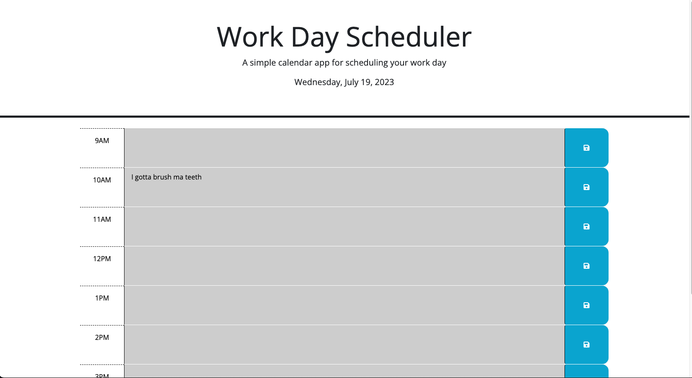

# <Workday-Scheduler>

## Description

- I want to learn how to code better and with this project I wanted to learn jQuery
- I built the project to get better at jQuery
- It is a planner basically.
- I learned how to use jQuery. I am not a master yet but I was able to finish this project.

## Usage

this is a picture of the planner

## Credits

UM Coding Bootcamp
w3 schools
jQuery

